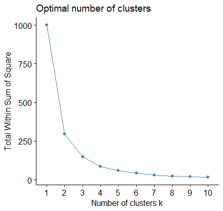

# Categorization using AMC and K-means

## Generate input data 
- An exposure variable including three categories, which was generated from three normal distributions 
- The ground truth of number of categories k equals to 3

``` r
# Generate input data
set.seed(123)
a0 = rnorm(100, mean = 1, sd=1)
a1 = rnorm(400, mean = 4, sd=1)
a2 = rnorm(500, mean = 7, sd=1)
input = data.frame(c(a0, a1, a2))
names(input) <- "X1"
b0 = rep(1, 100)
b1 = rep(2, 400)
b2 = rep(3, 500)
ground_truth = data.frame(c(b0, b1, b2))
names(ground_truth) <- "X1_ground_truth"
```

## Use AMC to categorize the variable
``` r
# install.packages("devtools")
# devtools::install_github("sitingLi/amc")
library(amc)
result = amc(input)
output <- result[["output"]]
group <- result[["group"]]
cat("The function categorizes this variable into", group, "categories.")
```
The amc function categorizes this variable into 3 categories.


## Get the confusion matrix to evaluate the categorization performance by amc
``` r
library(caret)
predicted_value <- factor(c(t(output)))
expected_value <- factor(c(t(ground_truth)))
confusionMatrix(data = predicted_value, reference = expected_value)
```
Accuracy and Kappa score by amc:

- Accuracy : 0.895           
- Kappa : 0.8188 


## Next, we use elbow method to select the k of k-means
``` r
#install.packages("factoextra")
library(factoextra)
input2 = scale(input)   # scale the input
input2 <- data.frame(input2)
fviz_nbclust(input2, kmeans, method = "wss") # Visualizing the Optimal k
```

We will determine the optimal k by elbow method:



We can select k = 3. (However, k = 4 looks more likely to be the elbow point, which will lead to the wrong number of categories. The optimal k of k-means in this example is ambiguous.) 


## Use K-means to categorize the variable

``` r
# Re-name the clusters of K-means (They have random names initially)
# The cluster with the smallest values should be named as cluster/category 1
library(dplyr)
n = dim(input)[1]
kvalue = 3

output_sim = matrix(NA, n, 1)
order = rep(1:n)                  
km_data_temp <- kmeans(input2$X1, kvalue, nstart = 1) # To compare the result, we use k = 3 in this k-means
temp = cbind(order, input2$X1, km_data_temp$cluster, rep(NA))  
temp = data.frame(temp)
temp = arrange(temp, V2)                
s=1
temp[1, 4] = s

for(j in 2:n)
{
  
  if(temp[j, 3] == temp[j - 1, 3])           
  {
    temp[j, 4] = s
  }
  else                             
  {
    s = s + 1
    temp[j, 4] = s
  }
}

temp = arrange(temp, order)          
output_sim = temp[, 4]              

```


## Get the confusion matrix to evaluate the categorization performance by K-means

``` r
# library(caret)
predicted_value2 <- factor(c(t(output_sim)))
confusionMatrix(data = predicted_value2, reference = expected_value)
```
Accuracy and Kappa score by K-means:
- Accuracy : 0.868   
- Kappa : 0.7797   


## Compare the results

AMC: the amc package itself selects the optimal k as 3

K-means: we select the optimal k by observing the elbow point (but the optimal k is ambiguous, we used k = 3 in this K-means to calculate the accuracy)

Accuracy and Kappa score by amc:
- Accuracy : 0.895           
- Kappa : 0.8188 

Accuracy and Kappa score by K-means:
- Accuracy : 0.868   
- Kappa : 0.7797  

(Using different version of R/R studio may generate slightly different accuracy and Kappa with set.seed() function)
